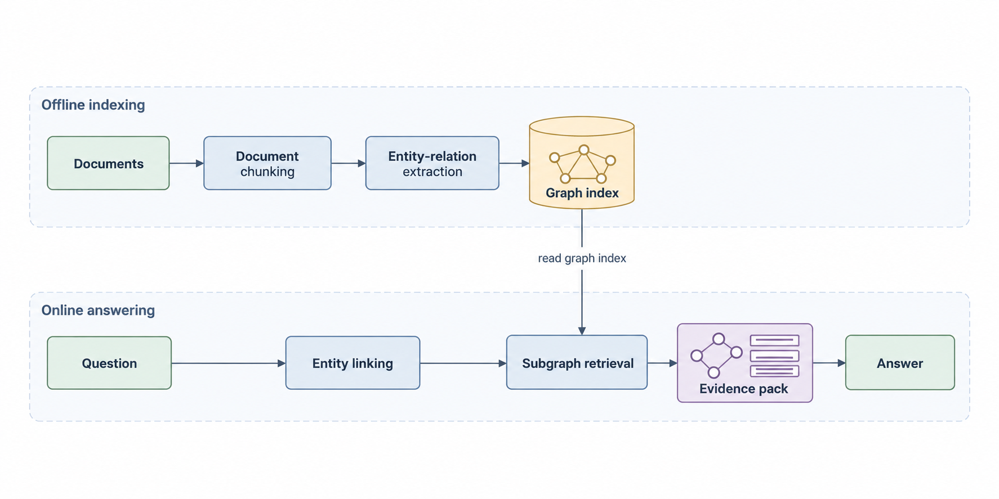

# 已实际执行的 GraphRAG 例子

此示例用内置 imagegen 生成，不是占位图或 SVG 改后缀。它将泳道布局 L08 与扁平柔和色块 V01 组合，T17 提供阶段布局，T18 提供图谱图元。两者均为原创通用蓝图，不声称为某篇 GraphRAG 论文的精确结构。

- [方法定义](../assets/examples/graph-rag-v01.brief.json)
- [实际最终提示词](../assets/examples/graph-rag-v01.final.prompt.txt)
- [所选参考与出处](../assets/examples/graph-rag-v01.references.json)
- [成图核对记录](../assets/examples/graph-rag-v01.review.json)

核对重点是 9 个系统节点、8 条有向系统箭头，以及 Graph index → Subgraph retrieval 的只读供给。图标内部小图是无向示意边，不能算作新增系统连接。没有 Answer → Graph index 回写。

此例便于 agent 学习流程，不是所有论文都该套用的模板。更换机制时重新编写 brief，再选风格。示例的实际投稿版面和期刊分辨率要求未做验证，使用前应按目标尺寸检查。
